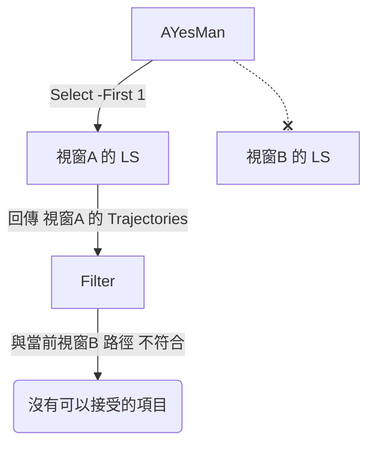

# AYesMan Session 獲取機制分析

嗨！透過 `/opsx-explore` 模式，我剛剛去追了 `extension.ts` 裡面有關找 Language Server 的邏輯，發現了**兩個**主要會導致「套件突然沒作用」或是「找不到對的 Session」的致命傷。

## 目前的 Session 獲取邏輯

這段程式碼會在背景，每兩分鐘（`fetchQuota`）和每 500ms（`autoAcceptLoop`）去嘗試讀取並接受建議：

1. **尋找 Process**: 透過 PowerShell 的 `Get-CimInstance` 尋找名稱為 `language_server` 的程序。
2. **提取 Port 與 CSRF Token**: 從 Command Line 找出 `--csrf_token`，再用 `Get-NetTCPConnection` 找聆聽中的 Port。
3. **快取起來 (Cache)**: 連線成功後，會把這個 `{port, csrfToken}` 存放在 `cachedServerInfo`。
4. **過濾軌跡 (Trajectories)**: 呼叫這個 server 的 `GetAllCascadeTrajectories`，並用 VS Code 目前視窗的 `workspaceFolders` 來過濾軌跡，只抓屬於當前視窗的。

---

## 為什麼會有時候失效？

### 致命傷 1：多開視窗（只取第一筆）

在 `findLanguageServerProcess()` 裡：

```powershell
Get-CimInstance Win32_Process -Filter "name LIKE 'language_server%'" | Select-Object -First 1
```

用了 `Select-Object -First 1`！
也就是說，如果你同時開著多個 VS Code / Cursor 專案，作業系統中可能會有 2 個以上的 `language_server.exe`。
AYesMan 永遠**只會抓系統裡第一個找到的 server**。

- 如果它剛好抓到「你背景沒在用的那個專案」的 server。
- 接著它去要 Trajectories，發現軌跡紀錄的 workspace path 跟你當前視窗路徑「不符合」（因為是被過濾掉了）。
- **結果：AYesMan 在這個視窗就完全發揮不了作用！**



### 致命傷 2：快取卡死（重啟無法更新）

如果在 VS Code 重新載入了視窗，或是底層的 Language Server 崩潰重啟，Port 會改變。
目前的機制把 `cachedServerInfo` 存起來後，在 `fetchQuota()` 中的呼叫：

```typescript
try {
  const userStatus = await callGrpc(server, "GetUserStatus");
  // ...
} catch (err: any) {
  console.error("[AYesMan] Quota fetch error:", err.message);
  // ★ 這裡只有印出 error，並沒有設 cachedServerInfo = undefined
  quotaStatusBar.tooltip = `AYesMan: Quota fetch error — ${err.message}`;
}
```

它忘記在遇到斷線或超時錯誤時去**清空快取**。

- 只要 server 換了 port，AYesMan 就會無止境地報錯 (Quota fetch error)。
- 同時 `autoAcceptLoop` 就一直對著一個「死掉的 port」狂打，完全不會去重新執行 `discoverServer()` 找新的 Port！

---

## 思考與解法 (探索結果)

如果我們要解決這個問題，我們可以朝這兩個方向思考：

1. **找全部的 Languages Servers**：
   把 `$_.ProcessId` 全抓出來，嘗試每一台 Server，直到找到其 `GetAllCascadeTrajectories` 裡面含有與 `currentWorkspacePaths` 符合的 Server 為止。
2. **清除快取 (Invalidate Cache)**：
   在 `fetchQuota` (或是 auto accept) 如果收到連線被拒絕 / Timeout / HTTP 500 時，把 `cachedServerInfo` 設為 `undefined`，這樣下次它就會重新掃描新的 Language Server。

覺得這個分析有符合你的猜測嗎？你想繼續深挖，還是想直接透過 OpenSpec 把它立項做成變更（`/opsx-new` 或 `/opsx-ff`）來修復它呢？
